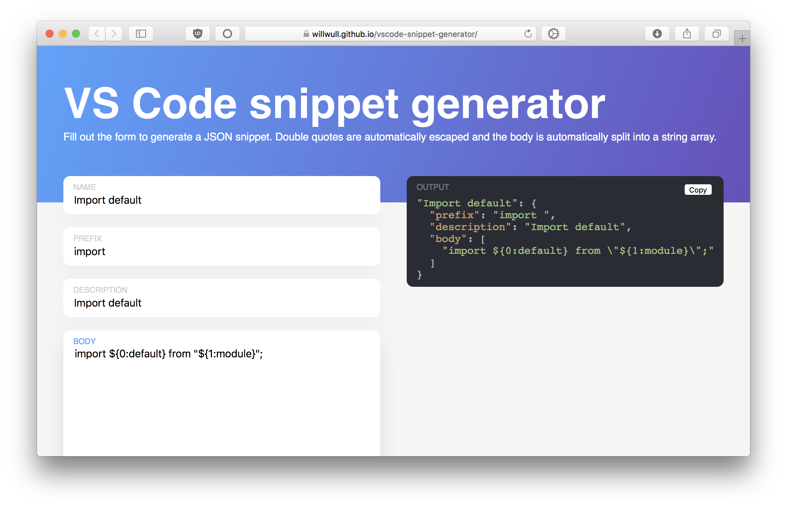

# vscode-snippet-generator
Paste in code and generate JSON to use in VS Code for custom code snippets. Try it out [here](https://willwull.github.io/vscode-snippet-generator/)!



Built with React in order to learn react-redux.

As the header says, all double quotes are automatically escaped, and the body is split into a string array.

## Run locally

```
$ npm start
```

## Build

```
$ npm run build
```
